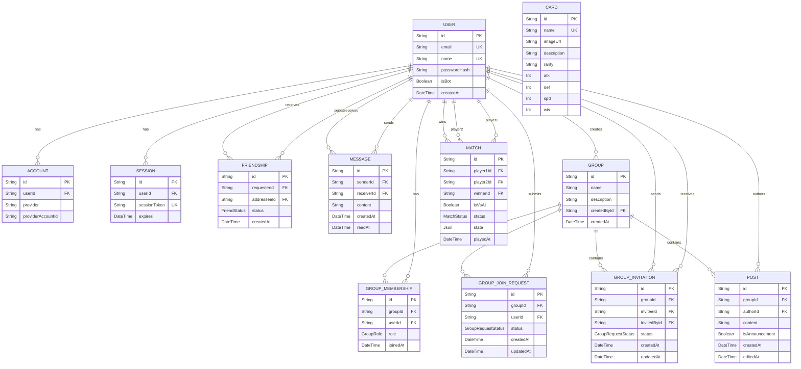

_This project has been created as part
of the 42 curriculum by david-fe, rde-fari, rimagalh._

# ft_transcendence - Card Game

### Description

A web-based 1v1 card game with blind drafting, dice-driven stat combat, live remote play, and an AI opponent.

## Instructions

### Prerequisites

Before running the project, make sure you have the following installed:

- Docker
- Docker Compose
- Make


You will also need to configure the project's environment variables using the provided `.env.example` file.

### Environment Configuration

Copy the example environment file

```bash
cp .env.example .env
```
Open `.env` and configure the required environment variables.


### Running the project

The project uses the provided Makefile as the main entry point. Make commands handle the underlying startup and Docker configuration.

```bash
make
```
To stop and clean up the project, use the appropriate cleanup target provided by the Makefile, for example:

```bash
make clean
```
The app can be acessed with github account or one of the seeded accounts like `dev1@example.com` / `dev2@example.com`, password `DevPassword123!` or one of the many other accounts that are in the seed.js's config section at the top, such as `alex@example.com` password `DemoPassword123!`.


## Team Information

**david-fe** - Product Owner/Manager

- Coordinated the overall project and helped establish the team and development workflow.

- Maintained communication between team members and coordinated project-related decisions and tasks.

- Focused on keeping development aligned with the project requirements and ensuring that the required functionality was delivered.

- Contributed to the implementation and development of project features alongside the rest of the team.


**rimagalh** - Technical Lead/Architect

- Proposed the initial project concept and defined the overall application structure.

- Researched and evaluated technologies and tools suitable for the project.

- Designed and implemented the database schema and established the project's technical foundation.

- Made key architectural and technical decisions regarding the application's development stack.

- Contributed to the implementation of the application's core functionality and features.


**rde-fari** - Developer

- Joined the project during the development phase and took ownership of the group's functionality.

- Designed and implemented the group management features, including group creation, membership, invitations, and related functionality.

- Contributed to the implementation of privacy, terms, and other essential application requirements.

- Assisted with testing and debugging to identify and resolve issues throughout development.

- Contributed to general development and integration of features with the rest of the application.


## Project Management

Tasks were divided by module. The implementation of the game and its associated modules was assigned to one member, while the remaining modules were distributed among the other members, who were able to select and complete their assigned modules from start to finish. This approach followed a task-based workflow similar to a Kanban system.

Project communication and coordination were conducted through Discord, with communication maintained throughout the development process. No dedicated project management tool was used.


## Tech Stack
- **Language:** JavaScript
- **Framework:** Next.js - used to provide both frontend and backend functionality within a single codebase, simplifying development and integration between the application layers.
- **Database:** PostgreSQL - selected for its reliability, performance and familiarity within the development team.
- **ORM:** Prisma - used to provide a structured interface for interacting with the PostgreSQL database, simplifying database queries and schema management.
- **Authentication:** Auth.js - used to implement user authentication, supporting both email/password authentication and OAuth providers.
- **UI:** Material UI - used to provide a consistent set of reusable interface components and reduce the amount of custom UI development required.

## Database

### Schema

The following diagram illustrates the main entities in the database and their relationships:



### Tables and Relationships

#### User and Authentication

The User table is the central entity in the database. It stores user account information and is referenced by most other functional areas of the application.

The Account and Session tables support authentication. Account stores OAuth provider information, while Session stores active authenticated sessions.

#### Friendships and Messaging

The Friendship table represents relationships between users. It contains separate foreign keys for the requester and addressee, allowing the direction of a friend request to be tracked. Its status field indicates whether the request is pending, accepted, or declined.

The Message table represents direct messages between users. Each message contains a senderId and receiverId, both referencing User, along with its content and creation timestamp.

#### Groups

Groups provide the application's organization and community functionality.

The Group table stores the group itself and references the user who created it through createdById.

GroupMembership acts as the membership relationship between users and groups. It stores the user's role (ADMIN or MEMBER) and the date they joined.

#### Cards

The Card table stores the cards used by the game's card system. Each card has a unique name, unused description and visual information, and four numerical attributes.
The rarity field is optional and indexed to improve queries filtering cards by rarity.

#### Matches

The Match table stores the final state and result of a game between two players. Each match references two User records through player1Id and player2Id.

The isVsAI field identifies matches against an AI-controlled opponent.

The status field tracks the match lifecycle, from CHOOSING and DRAFTING through PLAYING to either COMPLETE or ABANDONED.

The state field uses the JSON type to store the current live game state. This was chosen because the structure of the data varies depending on the current stage of a match and does not need to be represented as individual relational fields.

#### Key Fields and Data Types


| Entity | Key Fields | Data Types |
|---|---|---|
| User | `id`, `email`, `name`, `passwordHash`, `isBot` | `String`, `String`, `String?`, `String?`, `Boolean` |
| Account | `id`, `userId`, `provider`, `providerAccountId` | `String`, `String`, `String`, `String` |
| Session | `id`, `userId`, `sessionToken`, `expires` | `String`, `String`, `String`, `DateTime` |
| Friendship | `id`, `requesterId`, `addresseeId`, `status` | `String`, `String`, `String`, `Enum` |
| Message | `id`, `senderId`, `receiverId`, `content`, `readAt` | `String`, `String`, `String`, `String`, `DateTime?` |
| Group | `id`, `name`, `createdById` | `String`, `String`, `String` |
| GroupMembership | `id`, `groupId`, `userId`, `role` | `String`, `String`, `String`, `Enum` |
| GroupJoinRequest | `id`, `groupId`, `userId`, `status` | `String`, `String`, `String`, `Enum` |
| GroupInvitation | `id`, `groupId`, `inviteeId`, `invitedById`, `status` | `String`, `String`, `String`, `String`, `Enum` |
| Post | `id`, `groupId`, `authorId`, `content`, `isAnnouncement` | `String`, `String`, `String`, `String`, `Boolean` |
| Card | `id`, `name`, `rarity`, `atk`, `def`, `spd`, `wis` | `String`, `String`, `String?`, `Int`, `Int`, `Int`, `Int` |
| Match | `id`, `player1Id`, `player2Id`, `winnerId`, `isVsAI`, `status`, `state` | `String`, `String`, `String`, `String?`, `Boolean`, `Enum`, `JSON?` |

Primary keys are generally represented by the `id` fields with automatically generated values. Foreign keys such as `userId`, `groupId`, and `authorId` establish relationships between the tables.

## Features List

**rimagalh**
- Remote play PvP web card based game with optional AI
Opponent
    -  See [Game Overview](#game-overview)
- OAuth
    - Allows using a GitHub account to use the app


**david-fe**
- User interaction
    - User profiles, friendships and messaging
- Searching/Filtering
    - Allows browsing cards in a specialized interface
- Statistics & Leaderboards
    - Users can unlock achievements and see their position on a global leaderboard


**rde-fari**

- Groups
    - Allows users to join groups and interact with each other through a discussion board

#### Game Overview

- 15 cards are drawn from a 30-card catalog and placed face-down in a shared pool at match start.
- Players alternate drafting 7 cards each - blind, nobody knows what's under a slot until they claim it.
- A d6 roll decides who drafts first; the winner also chooses between drafting first or holding the priority token, used only as a tiebreaker if the match reaches sudden death.
- Each round, a rolled stat (ATK/DEF/SPD/WIS) is compared between the two played cards - higher value wins the round.
- Ties carry the round's point value forward, escalating the stakes of the next round. Round 6 is sudden death; the priority token breaks any final tie there.
- First to 3 points wins.
- Can be played against a real opponent or against AI

## Modules Claimed

| Module | Category | Type | Points |
|---|---|---|---|
| Frontend Backend Framework | Web | Major | 2 |
| User interaction | Web | Major | 2 |
| Database ORM | Web | Minor | 1 |
| Advanced search| Web | Minor | 1 |
| Game statistics & match history | User Management | Minor | 1 |
| Remote authentication | User Management | Minor | 1 |
| Organization system| User Management | Major | 2 |
| AI Opponent | AI | Major | 2 |
| Complete web-based game | Gaming | Major | 2 |
| Remote players | Gaming | Major | 2 |
| **Total** | | | **16** |

### Justification

The base technology stack was decided with a focus on having a relatively gentle learning curve and ease of use. Next.js was selected as the framework because it allows both the frontend and backend to be developed within the same ecosystem and language. This simplified development by avoiding the need to learn and maintain separate technologies for the frontend and backend. Prisma was selected as the ORM for similar reasons, as it provides a straightforward way of interacting with the database without requiring us to manually write SQL queries for common operations.

The central feature of the application was decided to be a card game, with the possibility of playing against another player remotely or against an AI opponent. From this starting point, the other functionality was planned around the requirements of a complete web-based game and the features that would reasonably be expected from a multiplayer application.

The selected modules therefore cover the main areas of the application: the web framework and user interaction provide the application itself, the database and authentication support persistent user accounts and data, the gaming modules provide the actual game functionality, and the remaining modules add features such as search, statistics, match history and groups.

| Module | Member | Justification |
|---|---|---|
| Frontend Backend Framework | Everyone| Next.js was chosen to handle both the frontend and backend using the same ecosystem and language, simplifying development. |
| User Interaction | david-fe | A multiplayer application requires ways for users to interact outside of the game itself, so a chat system, user profiles and a friends system were included to allow users to communicate and connect with each other. |
| Database ORM | Everyone  | Prisma was chosen to simplify database interaction through JavaScript and avoid writing manual SQL queries for common operations. |
| Advanced Search | david-fe |  Search functionality allows users to efficiently find relevant application data as the amount of stored information grows. |
| Game Statistics & Match History | david-fe | Storing previous matches allows users to review their game history and provides persistent statistics about their activity. |
| Remote Authentication | rimagalh | Provides users with secure and convenient access to their accounts and is a common feature in web applications. |
| Organization System | rde-fari | Organizations provide a way to group users and add user interaction beyond individual accounts. |
| AI Opponent | rimagalh | An AI opponent allows users to play the game without requiring another human player and provides an alternative way to interact with the game. |
| Complete Web-Based Game | rimagalh | The card game is the central feature of the application, requiring the game's rules, state, actions, turns and end conditions to be implemented through the web. |
| Remote Players | rimagalh | Remote multiplayer allows users to play the card game against each other through the web rather than requiring them to be on the same device. |


## Individual Contributions

### david-fe


Web, Major: basic user interaction

Profile
Displays user data like date joined and email (only in own profile), achievements and match history with detailed round breakdowns. It was kept rather simple, with mostly game related info as the focus.

Friends system
Allows for sending requests, canceling sent requests and responding to requests. Friending also enables chatting with those users, and viewing of their profiles, which is where the option of removing user as friends is available. 

Messages
Allows users to message their friends in a simple chat. Though overall simple, A challenge experienced here the creation of a new chat through the friends list, as well as the user interaction design/implementation of users that are removed as friends, no longer being shown as options to chat with. This was chosen over simply allowing the user to still view chat history but not message, to avoid unpleasant user interaction, doubling as a proper block feature. Despite this, the db retains user chat history in case the friendship is reinstated.

Web, Minor: search functionality
Card Search
Allows to compare and contrast cards out of game as a library, being the only place where cards are viewable out of game. It supports pagination, sorting by stats, name and rarity, and filtering by name and rarity. The card formatting was a challenge to get just right, to allow for a predictable structure and maintaining readability over a variety of different screen sizes.

User Management, Minor: game statistics
Achievements
Displays a few dynamically-tracked, game-related milestones. Achievements are locked and secret by default, but progress is easy to gain at first, represented in 3 tiers. A user that has a unlocked the first tier then gains access to the target number for the following tiers, as well as keeping an ever increasing counter of the relevant metric. The bigger challenge here was deciding a small amount of relevant and intuitive metrics that user would want to track and show off. The intent of making them initially unknown was to encourage playing further games (as playing 1 game is enough to unlock your first achievement), and encouraging checking friend profiles to track more achievements yet to unlock.

Leaderboard
Displays a point-based ranking of all users with completed matches, with 10 pts being awarded for a victory, and -3 on a loss, to encourage a mix of more matches with a good overall performance. The top 3 also gain an achievement as long as they maintain their ranking. Other factors like winrate are both displayed for curiosity and used in eventual tiebreaking.

### rimagalh

My task was to engineer the app, research technologies and setup the environments.
One of the first challenges was here, deciding which technologies to use, how to use and how beginner friendly they really were, so as to avoid having to learn many different technologies and stacks, per example a JS frontend with a Java backend, or a full stack in java with springboot, were decisions that I had to evaluate and consider for the rest of the team.

My first real task was to implement the authentication flow, with Auth.js, from there onward my responsibility was to implement the game and its associated features.

My challenges were all game design related, how to balance the playing field, the cards, the drafting, how to achieve a no tie at the end of a match were all things i thought necessary.

The game originally started as a "collector" but considering the limited amount of cards we have it wouldn't be fun to play, most matches would end in a tie because players would all start with the same cards, and on top of that having to figure out ways on how users could get more cards, so to make it more engaging I decided upon having 15 cards out of the 30 total being put in a draft pool, allowing a limited amount of duplicates in that pool, and how many each player should be allowed to pick.


### rde-fari


I implemented the groups feature and the Terms of Use page for the CardGame application. The groups feature allows logged-in users to create and join groups, see their members, make posts, create announcements, and manage group activity. I also added the administrator features for updating group information, inviting players, removing members, and deleting a group.

I also created the Terms of Use page, explaining the educational purpose of the project, user responsibilities, acceptable use, user-generated content, intellectual property, service availability, and limitations of liability.

---

- Specific features, modules, or components implemented:

Groups page showing the current user's group, group invitations, and options to create or open a group.
Group creation form with validation for the group name and description.
Group details page showing the description, members, announcements, and regular posts.
Post creation and editing, with a ten-minute editing limit.
Announcements and group settings available only to administrators.
Group settings page for changing the description, inviting players, removing members, and deleting the group.
Option for both regular members and administrators to leave a group.
Group API routes for creating, viewing, updating, and deleting groups, as well as managing members, invitations, posts, and requests.
Authentication and permission checks to make sure only logged-in members can access groups and only administrators can perform admin actions.
Terms of Use page with a responsive Material UI layout, page metadata, an effective date, and nine sections covering the project's terms and policies.

---

- Challenges faced and how they were overcome:

Understanding how the API routes worked was one of the biggest challenges for me, since I had never worked with these technologies before. I had to learn what an API is used for, how the different routes work, and how to make requests using the ORM. AI tools and YouTube were very helpful during this process and helped me understand and solve many of the problems I encountered.
Group permissions needed to be enforced both in the interface and on the server. I addressed this by restricting administrator controls in the UI and adding authorization checks to the API before allowing updates, invitations, member removal, or deletion.
The post editing requirement needed a time-based restriction. I implemented a ten-minute editing window and applied the correct permissions for authors and administrators editing announcements.
The Terms of Use content needed to be informative while still being appropriate for an educational project. I organized it into clear sections and made it clear that the project is for learning and evaluation, rather than a commercial or production service.

## Resources

- [Prisma Cheatsheet](https://devsheets.io/sheets/prisma)
- [MUI Documentation](https://mui.com/material-ui/getting-started/)
- [Next.js Documentation](https://nextjs.org/docs)


#### AI Usage

Claude was used for early architecture / design considerations, for evaluating tradeoffs and weight of features and their possible implementations.

AI was used to create generic seed data and code debugging, most of which styling assistance such as flex displays and properly aligning items.

AI was used in assistance to draft this document.

AI was not used as a substitute for decision making, design, or final feature acceptance.

