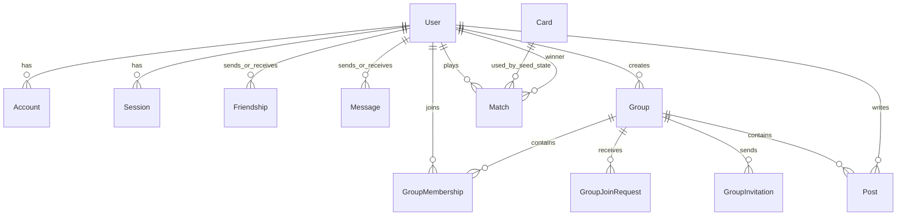

*This project has been created as part of the 42 curriculum by david-fe, rimagalh, rde-fari.*

# Card Arena

## Description

Card Arena is a full-stack multiplayer card game built as part of the 42 `ft_transcendence` curriculum. Players can create an account, find other players, start a match against a human or an AI opponent, draft a hand of cards, play rounds, and review their results.

The platform also provides the social features expected around a competitive game: profiles, friend requests, direct messages, player search, groups, group posts, invitations, a leaderboard, match history, and achievement badges.

### Key features

- Email/password registration and sign-in, with GitHub OAuth support.
- Human-vs-human and human-vs-AI matches.
- A multi-phase match flow: choosing, card drafting, playing, round resolution, and completion.
- Persistent match state and match history.
- Player profiles, rankings, statistics, and achievements.
- Search, friendships, direct messages, and unread-message tracking.
- Groups with membership roles, join requests, invitations, posts, announcements, and administration.
- Responsive Material UI interface with public terms and privacy pages.

## Instructions

### Prerequisites

- Node.js with npm. Node.js 20 or newer is recommended for Next.js 16.
- Docker Desktop or Docker Engine with Docker Compose.
- OpenSSL, used by the setup script to generate `AUTH_SECRET`.
- A GitHub OAuth application if GitHub sign-in is enabled.

### Environment configuration

Copy the example configuration before running manually:

```bash
cp .env.example .env
```

The default `DATABASE_URL` matches the PostgreSQL container from `docker-compose.yml`. Set a generated secret in `AUTH_SECRET`:

```bash
openssl rand -base64 32
```

For GitHub authentication, add the credentials supplied by GitHub to `AUTH_GITHUB_ID` and `AUTH_GITHUB_SECRET`. The OAuth callback URL for local development is:

```text
http://localhost:3000/api/auth/callback/github
```

### Recommended setup

The setup script starts the database, installs dependencies, creates `.env` when necessary, applies migrations, generates Prisma Client, seeds development data, and starts Next.js:

```bash
chmod +x start.sh
./start.sh
```

Open `http://localhost:3000` after the development server starts.

### Manual setup

```bash
docker compose up -d
npm install
npx prisma migrate dev
npx prisma generate
npx prisma db seed
npm run dev
```

Useful commands:

```bash
npm run lint       # Run ESLint
npm run build      # Create a production build
npm start          # Serve the production build
npx prisma studio  # Inspect the database in Prisma Studio
```

To stop the database container:

```bash
docker compose down
```

The PostgreSQL data is stored in the Docker volume `pgdata`. Remove that volume only when a fresh local database is intended.

## Team Information

### david-fe

- **Roles:** Product Owner and Developer.
- **Responsibilities:** Helped define the product direction and acceptance goals, and contributed to the application implementation, authentication flow, and game-related work.

### rimagalh

- **Roles:** Project Manager, Tech Lead, and Developer.
- **Responsibilities:** Coordinated delivery, helped establish technical direction and integration boundaries, and contributed to the core application and game implementation.

### rde-fari

- **Role:** Developer.
- **Responsibilities:** Contributed to the web application, gameplay and supporting features, including implementation and integration work across the frontend and backend.

Role ownership is based on the team assignment supplied for the project. Individual feature ownership below is based on the repository history and should be updated if the team maintains a separate task board.

## Project Management

The team organized the work by feature branches and integrated completed work through Git merges and pull requests. The repository history shows separate development areas for the game, OAuth, groups, leaderboard, match history, and achievements, followed by integration into `main`.

- **Task distribution:** Feature-oriented branches and ownership of separate application areas.
- **Version control and review:** GitHub repository, branches, merge commits, and pull requests.
- **Communication:** The repository does not record the team's private communication channel. The project team should document the actual channel used for evaluation, such as Discord or Slack, if required.
- **Meetings:** Planning, progress checks, and integration discussions were handled by the team; meeting records are not stored in this repository.

## Technical Stack

| Area | Technology | Reason for choice |
| --- | --- | --- |
| Frontend | Next.js 16, React 19 | Component-based UI with routing and server-side application support in one framework. |
| UI | Material UI 9, Emotion | Accessible, responsive components and consistent styling. |
| Backend | Next.js route handlers | Keeps the HTTP API close to the pages while using the same JavaScript codebase. |
| Authentication | NextAuth.js/Auth.js, credentials, GitHub OAuth | Supports local accounts and an external OAuth provider with session handling. |
| ORM | Prisma 7 | Type-safe access to the relational database and versioned migrations. |
| Database | PostgreSQL 18 | A durable relational database suited to users, social relationships, groups, and match records. |
| Validation/security | bcryptjs, Auth.js session callbacks | Password hashing and authenticated API access. |
| Local infrastructure | Docker Compose | Reproducible local PostgreSQL setup. |

The match engine is implemented in JavaScript modules under `lib/game`, with JSON match state persisted by Prisma. This keeps the state machine explicit while allowing a match to be resumed or polled by the client.

## Database Schema

The database is PostgreSQL and is managed through Prisma migrations in `prisma/migrations`.



The main entities are:

- **User:** identity, email, optional password hash, OAuth accounts, bot flag, and relations to all social and game data.
- **Account and Session:** Auth.js provider accounts and sessions.
- **Friendship:** requester, addressee, status, and creation time.
- **Message:** sender, receiver, content, read timestamp, and creation time.
- **Group, GroupMembership, GroupJoinRequest, GroupInvitation:** group ownership, roles, membership workflows, and invitations.
- **Post:** group content, author, announcement flag, and timestamps.
- **Card:** card name, rarity, image/description, and integer attributes `atk`, `def`, `spd`, and `wis`.
- **Match:** two players, optional winner, AI flag, status, JSON game state, last-seen timestamps, and play date.

The schema uses foreign keys, unique constraints, indexes, and cascading deletes where group-owned data should be removed with its parent group.

## Features List

| Feature | Contributors | Description |
| --- | --- | --- |
| Authentication and accounts | david-fe, rimagalh, rde-fari | Credentials registration/sign-in and GitHub OAuth through Auth.js. |
| Card game engine | david-fe, rimagalh, rde-fari | Match state machine covering choice, draft, play, roll, resolution, completion, and abandonment. |
| AI opponent | david-fe, rimagalh, rde-fari | Automated choice, draft, and play decisions for AI matches. |
| Friends and search | david-fe, rimagalh, rde-fari | Find players and manage pending, accepted, and declined friend requests. |
| Direct messages | david-fe, rimagalh, rde-fari | Persistent one-to-one messages with read state. |
| Groups | rimagalh, rde-fari | Create groups, manage members and roles, request or invite membership, and leave groups. |
| Group posts | rimagalh, rde-fari | Publish, edit, delete, and highlight group announcements. |
| Leaderboard and match history | rimagalh, rde-fari | Browse rankings and completed match records. |
| Profiles and achievements | devRMoreira / rde-fari, rimagalh | Display player information, statistics, achievement progress, and rank icons. |
| Legal pages | david-fe, rimagalh, rde-fari | Public terms and privacy pages. |

## Modules

The following mapping records the implemented curriculum modules. The point values use the requested convention: **Major = 2 points** and **Minor = 1 point**. The exact module labels can be aligned with the final evaluation sheet if the school assigns different names.

| Module | Type | Points | Implementation | Contributors |
| --- | --- | ---: | --- | --- |
| Web application | Major | 2 | Next.js/React application with navigation, authenticated pages, and route handlers. | All team members |
| Database and ORM | Major | 2 | PostgreSQL in Docker, Prisma schema, migrations, seed, and relational APIs. | All team members |
| User authentication | Major | 2 | Credentials authentication, bcrypt password hashing, Auth.js sessions, and GitHub OAuth. | david-fe, rimagalh |
| Game and AI opponent | Major | 2 | Server-side match state machine, card draft, rounds, polling, and AI decisions. | All team members |
| Social features | Minor | 1 | Friends, search, direct messages, groups, posts, requests, and invitations. | rimagalh, rde-fari |
| Leaderboard and achievements | Minor | 1 | Ranking calculations, match statistics, achievement checks, and rank icons. | rde-fari, rimagalh |
| Responsive UI and design system | Minor | 1 | Material UI components, Emotion styling, responsive layouts, and shared navigation. | All team members |

**Total represented by this mapping: 11 points.** This is a project documentation summary, not a replacement for the official 42 evaluation rubric.

## Individual Contributions

### david-fe

Contributed as Product Owner and Developer, helping shape the product goals and contributing to authentication, account flows, core game work, and integration. Challenges included coordinating authenticated user state with protected pages and keeping the game flow compatible with both human and AI opponents.

### rimagalh

Contributed as Project Manager, Tech Lead, and Developer. Work included technical coordination, game and application integration, authentication/OAuth work, group and leaderboard areas, and maintaining the project structure. The main challenges were integrating several independent workflows around a shared Prisma schema and preserving consistent authorization rules.

### rde-fari

Contributed as Developer across gameplay, social features, profiles, leaderboard, achievements, UI, and API integration. The main challenges were representing multi-step matches as persistent JSON state and connecting derived statistics and achievements to match history without duplicating game logic.

The commit history also contains GitHub identities such as `devRMoreira`, `rodrigo-fari`, and local author aliases. Those aliases were consolidated here under the three team logins required by the project brief.

## Resources

- [Next.js documentation](https://nextjs.org/docs)
- [React documentation](https://react.dev/learn)
- [Material UI documentation](https://mui.com/material-ui/getting-started/)
- [Auth.js documentation](https://authjs.dev/)
- [Prisma documentation](https://www.prisma.io/docs)
- [PostgreSQL documentation](https://www.postgresql.org/docs/)
- [Docker Compose documentation](https://docs.docker.com/compose/)
- [Fisher-Yates shuffle algorithm](https://en.wikipedia.org/wiki/Fisher%E2%80%93Yates_shuffle), used by the draft pool implementation.

### Use of AI

AI tools were used as development assistance for code exploration, debugging, documentation drafting, reviewing implementation details, and suggesting small refactors or test ideas. Human team members made the architectural decisions, reviewed generated suggestions, integrated the code, and remained responsible for the final implementation. AI was not used as a substitute for team ownership of the game rules, authentication decisions, database design, or final feature acceptance.

## Known Limitations

- Direct messages currently use request/response APIs and are not real-time.
- Match updates use client polling rather than a WebSocket transport.
- OAuth provider credentials must be supplied by the developer; they are intentionally absent from the repository.
- The repository does not include formal meeting notes or the private communication history.

## License

This project was created for educational purposes as part of the 42 curriculum. No separate open-source license has been specified.